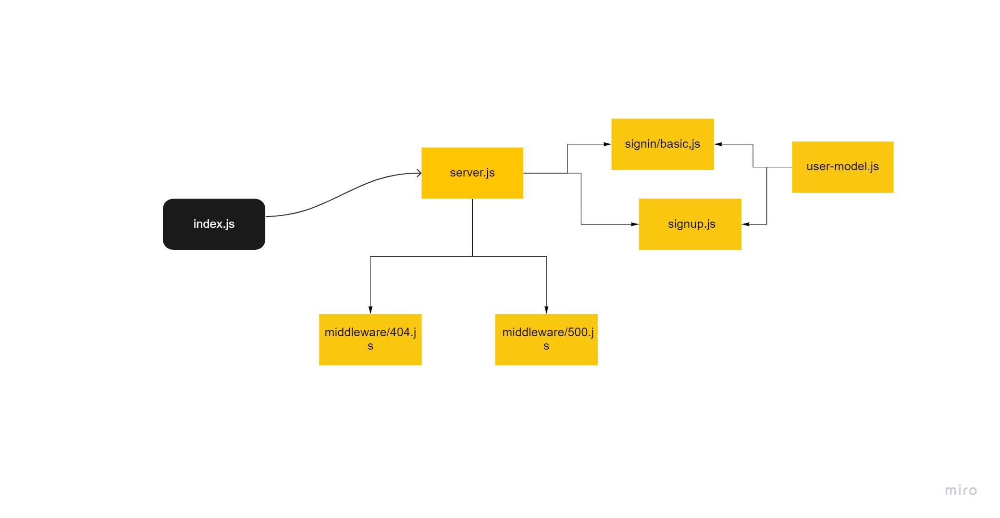

# basic-auth

## my notes

1. Make a POST request to the/signup route with username and password 
2. Make a POST request to the /signin route 
3. index.js (entry point),Connect to the database
4. server.js service wiring,Exports an express app/server and a start method

5. Extract the authentication logic for /signin as middleware.
6. Extract the Sequelize Model into a separate module
7. Create a POST route for /signup
8. Create a POST route for /signin

## UML

+ [heruko]()
+ [open pull req]()
+ [actions]()
